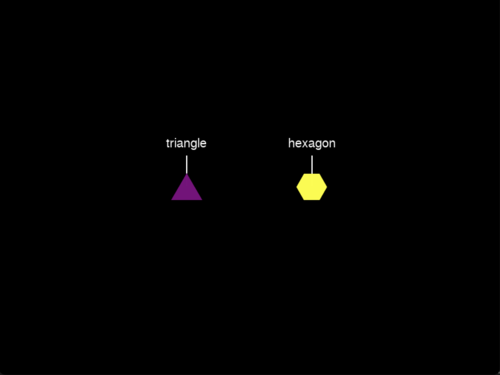

# Session 2: Introduction to Expyriment

## Table of Contents
- [Preliminaries](#preliminaries)
- [First expyriment script](#first-expyriment-script)
- [Session 2: Exercises](#sesssion-2-exercises)
    - [Exercise 1: Superimposed objects](#exercise-1-superimposed-objects)
    - [Exercise 2: Side-by-side objects](#exercise-2-side-by-side-objects)
    - [Exercise 3: Causal perception](#exercise-3-causal-perception)
        - [3A: Michottean launching](#3a-michottean-launching)
        - [3B: Disrupting the causal perception via a temporal gap](#3b-disrupting-the-causal-perception-via-a-temporal-gap)
        - [3C: Disrupting the causal perception via a spatial gap](#3c-disrupting-the-causal-perception-via-a-spatial-gap)
        - [3D: From launching to triggering](#3d-from-launching-to-triggering)
        - [3E: Launching function](#3e-launching-function)
        - [3F: Optional challenge](#3f-optional-challenge)
    - [Exercise 4: Labeled shapes](#exercise-4-labeled-shapes)
        - [4A: Triangle and hexagon](#4a-triangle-and-hexagon)
        - [4B: Polygon function](#4b-polygon-function)

## Preliminaries
First, update the Materials folder on your computer with the latest version of our repository. **Make sure to change ```your-path``` to the correct path!**

```bash
cd your-path/Programming/Materials/
git pull
```

Second, copy the Week-2 subfolder from **Materials** to **Assignments**. **Again, make sure to change ```your-path``` to the correct path!**

```bash
cd your-path/Programming/Assignments/
cp -R ../Materials/Week-2 .
```

## First expyriment script
```bash
cd your-path/Programming/Assignments/
cd Week-2/Exercises
python circle.py
```

```python
# Import the main modules of expyriment
from expyriment import design, control, stimuli

# Create an object of class Experiment: This stores the global settings of your experiment & handles the data file, screen, and input devices
exp = design.Experiment(name = "Circle")

# Initialize the experiment: Must be done before presenting any stimulus
control.initialize(exp)

# Create a fixation cross (color, size, and position will take on default values)
fixation = stimuli.FixCross() # At this stage the fixation cross is not yet rendered

# Create a 50px-radius circle
circle = stimuli.Circle(radius=50)

# Start running the experiment
control.start(subject_id=1)

# Present the fixation cross
fixation.present(clear=True, update=True)

# Leave it on-screen for 1,000 ms
exp.clock.wait(1000)

# Remove the cross and replace it with a circle
circle.present(clear=True, update=True)

# Leave it on-screen until a key is pressed
exp.keyboard.wait()

# End the current session and quit expyriment
control.end()
```

# Sesssion 2: Exercises
When solving the exercises, you might want to add this line at the beginning of your scripts: ```control.set_develop_mode()```. This saves time by setting these global variables to the following values:

```python
expyriment.control.defaults.initialise_delay = 0 # No countdown
expyriment.control.defaults.window_mode = True # Not full-screen
expyriment.control.defaults.fast_quit = True # No goodbye message
```

Once you're happy with the solution, comment this line out before pushing to GitHub.

## Exercise 1: Superimposed objects
In **Assignments/Exercises**, you will find a python script called `square.py`. Based on the example script above (`circle.py`), create a script that displays a fixation cross **inside** a blue square of length 50 for **half a second**, then removes the fixation cross and displays only the **blue** square of length 50 until a key is pressed.

Hints: 
- You might want to have a look at expyriment's `stimuli.Rectangle` [documentation](https://docs.expyriment.org/expyriment.stimuli.Rectangle.html#expyriment.stimuli.Rectangle): the color of the square can be set when initializing the object (note that expyriment uses UK spelling, so use *colour* instead of *color*)
- Mind the arguments you pass to ```present```

## Exercise 2: Side-by-side objects
Open `two_squares.py`. Write a script that displays two squares side by side, the left one red, the right one green. Leave the fixation cross out. The two squares should be separated by 200 pixels but centered as a whole. Present them on-screen until a key is pressed.

Hints: 
- By default, stimuli are presented at the center of the screen, so you need to modify this via the ```position``` attribute of shapes
- Shape size can be set when initializing the shape (e.g., ```stimuli.Rectangle(..., position = (x, y))```), or afterward (e.g., ```square_1.position = (x, y)``` or ```square_1.reposition(x, y)```)
- The position of the shape corresponds to the coordinates at the shape's center
- Expyriment takes (0, 0) to be the center of the screen and measures space in pixel units

## Exercise 3: Causal perception
### 3A: Michottean launching
Check out the first video at [this link](https://www.jfkominsky.com/demos.html), under **Launching and simple non-causal events**. Duplicate`two_squares.py` in the same **Assignments/Week-2/Exercises** subfolder and rename it to `launching.py`. Modify the code as follows: 
1. Present the two squares side by side for 1 second but modify their positions such that:
    - the red square starts on the left side, 400 pixels left from the center
    - the green square starts at the center
2. Using the ```position``` [attribute](https://docs.expyriment.org/expyriment.stimuli.Rectangle.html#expyriment.stimuli.Rectangle) or the ```move``` [method](https://docs.expyriment.org/expyriment.stimuli.Rectangle.html#expyriment.stimuli.Rectangle.move), animate the left square to move to the left until it reaches the green square. Adjust the speed to approximately match the one in the video.
3. Once the red square reaches the green square, the green square should move to the right, at the same speed and for the same amount of time as the red square.
4. Show this display for 1 second.
5. Add explanatory comments at each step in the script.

**Do you get the impression that the red square causes the green square to move?**

Things to consider:
- How do I move a square to the left at a given speed?
- How do I encode the collision moment between the two squares?

### 3B: Disrupting the causal perception via a temporal delay
Create a copy of ```launching.py``` and rename it to ```launching_disrupt_time.py```. Change the code to introduce a temporal delay between the squares' collision and the movement onset of the green square. First, try out a long delay (```exp.clock.wait(2000)```) and notice how the sense of causality disappears. Play around with different values of the delay. Can you find the threshold at which the delay does **not** disrupt your impression of causality?

### 3C: Disrupting the causal perception via a spatial gap
Create a copy of ```launching.py``` and rename it to ```launching_disrupt_space.py```. Modify the script by introducing a spatial gap between the two squares. Play around with different values of the gap. Gradually reduce this gap until you find the threshold at which it does **not** disrupt causality.

### 3D: From launching to triggering
Create a copy of ```launching.py``` and rename it to ```triggering.py```. Make the green square on the right move at a speed three times faster than the square on the left. Does it still look like the red square caused the green square to move?

### 3E: Launching function
Combine everything into a single function that displays a horizontal launching event. The function should take parameters that determine:

- whether there is a temporal gap,
- whether there is a spatial gap, and
- whether the second square moves at the same speed as the first square or at a higher speed.

The program should display the four types of events in succession: Michottean launching, launching with a temporal gap, launching with a spatial gap, and triggering. Save your script as ```launching_function.py```.

### 3F: Optional challenge
Display three consecutive launching events, but instead of horizontal motion, have the axis of motion be randomly selected each time from a full circle. To simplify things, keep the central green square where it is, and choose a random position for the red one on a circle with radius size equal to 300px. The green square should move toward the red square and launch it **upon contact**. The launched object should travel at the same speed and for the same amount of time as the green square. Save it in a script called ```launching_random_motion.py```.

Hints: 
- This will require trigonometry
- Take care when coding the moment of collision—There should be no gap or overlap between the two squares (check [this method](https://docs.expyriment.org/expyriment.stimuli.Rectangle.html#expyriment.stimuli.Rectangle.overlapping_with_stimulus) out; if using it, be mindful that it returns 2 values, not one)

*Credits to [Jonathan Kominsky](https://www.jfkominsky.com) for this problem*

## Exercise 4: Labeled shapes
### 4A: Triangle and hexagon
Duplicate `two_squares.py` (create a copy of it) and rename it to `labeled_shapes.py`.
1. Replace the red square on the left with a purple equilateral triangle (side length: 50).
2. Replace the green square on the right with a yellow regular hexagon. The two shapes should match in height.
3. Add 50px-long and 3px-wide white vertical lines going upwards from the top of each shape. 
4. Add shape labels on top of the line segments ("triangle" and, respectively, "hexagon"), 20px away from the upper end of the segments. The color of the font should be white.
5. Present this display until a key is pressed.



Hints:
- To find out how to present polygons, lines, and text of various kinds, check out expyriment's documentation:
    - ```Shape``` [documentation](https://docs.expyriment.org/expyriment.stimuli.Shape.html), in particular the **Notes** under ```__init__```
    - ```Line``` [documentation](https://docs.expyriment.org/expyriment.stimuli.Line.html)
    - ```TextLine``` [documentation](https://docs.expyriment.org/expyriment.stimuli.TextLine.html)

### 4B: Polygon function
If you've already coded Exercise 4A by using a polygon-generating function, no need to do anything. Otherwise, duplicate `labeled_shapes.py` and rename it to `labeled_shapes_function.py`. Refactor the code to include a function that generates a labeled regular polygon with **n** sides of a given **length** and **color**, and at a certain **position**. Recreate the display in Exercise 4A using this function.