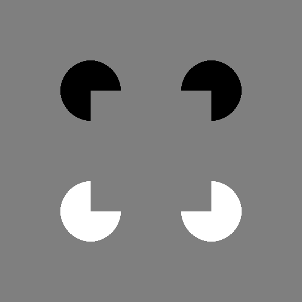
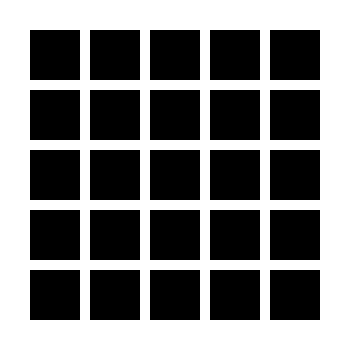

# Session 3: Expyriment stimuli (what, how, where)

## Table of Contents
- [Exercise 1: Screen edges](#exercise-1-screen-edges)
- [Exercise 2: Kanizsa square](#exercise-2-Kanizsa-square)
- [Exercise 3: Kanizsa rectangle](#exercise-3-Kanizsa-rectangle)
- [Exercise 4: Hermann grid](#exercise-4-Hermann-grid)

## Exercise 1: Screen edges
In **Assignments/Exercises**, you will find an empty python file called `display-edges.py`. Write a script that displays four fully visible squares with red contours (square length: ~5% of the screen width, line width: 1 pixel) at the screen edges until a key is pressed. The display must be independent of screen resolution (to check this, run with and without ```control.set_develop_mode()```).

## Exercise 2: Kanizsa square
Create a [Kanizsa square](https://en.wikipedia.org/wiki/Illusory_contour). The perceived square should have the side length = 25% of the screen width, and the circle size should also be set relative to screen size. Save as `kanizsa-square.py`. 



**Hint**: When initializing the exp object, set the ```background_colour``` to ```C_GREY``` (import it from ```expyriment.misc.constants```).

## Exercise 3: Kanizsa rectangle
Take your existing ```Kanizsa-square``` code and modify it in a file called  ```kanizsa-rectangle.py``` so that it displays a rectangle instead of a square.
- The rectangle should have a given aspect ratio (width over height)
- Its size should be controlled by a scaling factor
- The inducing circles should also be scaled by their own scaling factor.

Put all of this inside a function. The function should take three arguments:
1. The aspect ratio of the rectangle.
2. The scaling factor for the rectangle.
3. The scaling factor for the circles.

Hint: When initializing the exp object, set the ```background_colour``` to ```C_GREY``` (import it from ```expyriment.misc.constants```).

**Experiment with these parameters: Does the perceived strength of the illusory contours change depending on them?**

## Exercise 4: Hermann grid
Write a ```hermann-grid.py``` program that generates a [grid illusion](https://en.wikipedia.org/wiki/Grid_illusion). The program should have customizable grid parameters controlling the **size** and **color** of the squares, the **space** between them, the number of **rows** and number of **columns**, and the screen **background color**.



**Hints**:
- Use paper and pencil to draw the figure
- Think how to compute the center of the square in row *i* and column *j*
- Use nested loops to draw each square one by one

**Play around with these parameters and test your perception: What factors does the illusion most depend on?**